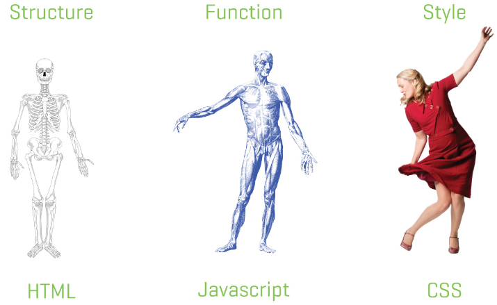
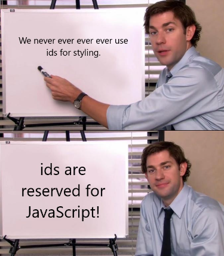

# Introduction to CSS

---

## CSS or Counterfeit Stainless Steel

*actually it's Cascading Style Sheets



---

- We use CSS to change the look of our content.
- CSS is used to change page layout, colors, fonts, text-sizes, image size, etc…
- You can do almost anything presentational with CSS.
- You are limited only by your knowledge of CSS.

---

## Linking CSS to the HTML

There are two ways of adding CSS to an HTML file

---

## Method 1

Put the style directly in the HTML:

```html
<!DOCTYPE html>

<html>
    <head>
        <title>A Basic HTML Template</title>
        <style>
            .custom-class {
                color: red;
            }   
        </style>
    </head>
    <!-- ... -->
```

This is generally frowned upon because a CSS can take up a lot of space really fast.

---

## Method 2

Link the CSS file in the HTML file:

```html
<!DOCTYPE html>

<html>

    <head>
        <title>A Basic HTML Template</title>
        <link href="styles.css" rel="stylesheet">
    </head>
```

The `<link>` tag is used to import the CSS file containing rules applying the styles to the elements of the HTML.

---

## Using CSS selectors

We can apply styles by targeting an HTML element directly through it's tag.


HTML:
```html
<h1>My Amazing Blog!</h1>
<h1>My Fantastic Title!</h1>
```

CSS:
```css
h1 {
    color: red;
}
```

Here we're targetting the `<h1>` tag directly in the CSS. The style will be applied to **all** h1 tags.

---

## Using CSS selectors

We can also apply styles by targetting a specific class.

HTML:
```html
<h1>My Amazing Blog!</h1>
<h1 class="title">>My Fantastic Title!</h1>
```

CSS:
```css
.title {
    color: red;
}
```

Here we're targetting the `<h1>` tag through it's class. The style will only be applied to all tags that **share the same class**.

---

## Using CSS selectors

We can apply styles a third way, by targetting it's id.

HTML:
```html
<h1>My Amazing Blog!</h1>
<h1 id="title">>My Fantastic Title!</h1>
```

CSS:
```css
#title {
    color: red;
}
```

Here we're targetting the `<h1>` tag through it's id. The style will only be applied to that element because **ids are unique**.

---

## Styling with ids

**Avoid styling with ids!**

Ids **MUST** be unique and if you want to apply the same style to multiple elements, you'll have to create a unique id for each element and adding a style for each id created. It gets very annoying.

In HTML, if an id exists more than once on the page, everything breaks! Classes on the other hand can be repeated an infinite number of times. Stick to styling with classes.

---

## Which selector should I use?

| Type  | HTML  | Selector | Rating |
|-------|-------|----------|--------|
| class | `<h1 class="title">` | .title |   👍👍    |
| tag   | `<h1>`               | h1     |   👍      |
| id    | `<h1 id="title">`    | #title |   👎👎👎  |

Basically never style by using an id. Classes are always your best choice.

---

## Selectors can be combined

HTML:

```html
<ul>
    <li>Bingo was his name-o.</li>
    <li class="secret">I have super-powers!</li>
    <li class="loud">
        I eat <span class="bold">bacon</span>
    </li>
</ul>
```

---

## Selectors can be combined

CSS:

```css
li {
    color: green;
}

.secret {
    color: blue;
}

li.loud {
    text-transform: uppercase;
}

.loud span {
    font-weight: bold;
}
```

---

## Specificity

HTML:

```html
<p class="blue">What color am I?</p>
```

CSS:

```css
p {
    color: red;
}

.blue {
    color: blue;
}
```

---

## Specificity

Different selectors have different strengths.
- A class beats a tag.
- A combined class+tag beats a class
- An id beats just about everything.

---

When styling HTML, we should...
- **Always** use classes.
- **Sometimes** use tags.
- **Never** use ids.
- **Never, ever** use ids.

---

