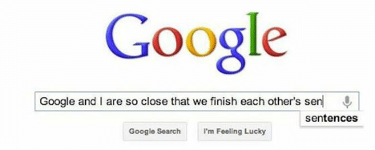
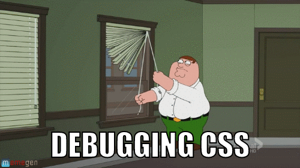

# CSS Properties

---

CSS Properties are used to indicate which styles to apply

```css
.mybox {
    color: #000;
    border: 1px solid red;
    background-color: red;
}
```

- There are many CSS properties. Tons. Way too many to cover.
- Use this CSS properties reference: [CSS Reference (Mozilla)](https://developer.mozilla.org/en-US/docs/Web/CSS/Reference#Keyword_index)
- VS Code can also autocomplete various properties. 

---

## Google is your friend! 😎



- The human brain cannot hold the full library of CSS properties and values.
- The web has many very good resources on CSS.

---

## The box model

Every HTML element is a box that has four properties.


---

## The box model

Each side can be set independently or all at once.

```css
.model {
    margin-top: 24px;
    margin-right: 0px;
    margin-bottom: 5px;
    margin-left: 10px;
}
```

or

```css
.model {
    margin: 24px 0px 5px 10px;
    /* top right bottom left */
}
```

---

## The box model

The shorthand version is usually the best option.

|           Example          |  ⬆   |  ➡  |   ⬇  |  ⬅  |
|----------------------------|------|------|------|------|
| margin: 24px 0px 5px 10px; | 24px |  0px |  5px | 10px |
|    margin: 24px 0px 5px;   | 24px |  0px |  5px | 0px  |
|      margin: 24px 0px;     | 24px |  0px | 24px | 0px  |
|        margin: 24px        | 24px | 24px | 24px | 24px |

---

## The box model - gotcha!

What are the dimensions of the greeting?

```html
<p class=”greeting”>Howdy!</p>
```

```css
.greeting {
    background: gold;
    border: 10px solid black;
    height: 100px;
    margin: 50px;
    width: 100px;
}
```

---

We can answer that question by adding:

```css
* {
    box-sizing: border-box;
}
```

- The `box-sizing` property calculates the actual width/height of an element and adjusts the styling accordingly.
- By setting the property to `border-box` we're taking into consideration the content, padding and border of the element.

Try it out for [yourself](https://codepen.io/gnomecircle/pen/OJRaoJw?editors=1100)!

---

## Positioning:

| Value | Description |
|-------|-------------|
| static | Default. It is always positioned according to the normal flow of the document. |
| fixed | It is positioned relative to the viewport. It always stays in the same place even if the page is scrolled. The top, right, bottom, and left are used to position the element. It is pulled out of the flow of content. |
| relative | It is positioned relative to its normal position. Setting the top, right, bottom, and left properties of a relatively-positioned element will cause it to be adjusted away from its normal position. Other content will not be adjusted to fit into any gap left by the element. |
| absolute | It is positioned relative to the nearest positioned ancestor. If an absolute positioned element has no positioned ancestors, it uses the document body, and moves along with page scrolling. |

> When using the `absolute` property, you will need to set the parent's position as well, anything but `static`.

---

## z-index

- The z-index property specifies the stack order of an element.
- An element with greater stack order is always in front of an element with a lower stack order.
- It only works on positioned elements (absolute, relative, fixed, or sticky).

```css
/* does not work */
.title {
    z-index: 1;
}

/* works */
.item {
    position: fixed;
    z-index: 1;
}
```

---

## Display

| Value | Description |
|-------|-------------|
| block | Default for block HTML elements. Diplays an element on a new line, and takes up the whole width. |
| inline | Default for inline HTML elements. Displays an element as an inline element. Any height and width properties will have no effect. |
| inline-block | The element itself is formatted as an inline element, but you can apply height and width values. |
| none | The element is completely removed! Disappears from the HTML too. |
| flex | This one gets it's own slides! |

---

## Display flex (basics)

- Flexbox is a wonderful way of positioning elements on a webpage.
- It does have a bit of a learning curve, but it's well worth it!
- Giving the **parent container** the property “display: flex”, automagically sets all of the items inside the container to be side-by-side.
    - It overwrites block/inline elements.
    - It moves all the space between elements and puts it at the end of the line instead.

```css
/* the first value to each property is the default value */
.item {
    display: flex;
    flex-direction: row | row-reverse | column | column-reverse;
    flex-wrap: nowrap | wrap | wrap-reverse;
    justify-content: flex-start | flex-end | center | space-around | space-between;
    align-items: stretch | baseline | center | flex-start | flex-end;
    align-content: stretch | center | flex-start | flex-end | space-around | space-between;
}
```

---

## Display flex

[A complete guide to flexbox](https://css-tricks.com/snippets/css/a-guide-to-flexbox/)

---

